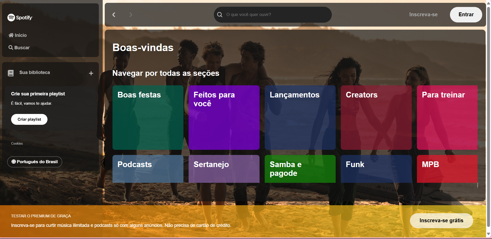

# 🎵 Projeto de Recriação do Spotify com Tema Outer Banks


## 💡 Sobre o Projeto

Este projeto foi desenvolvido durante uma imersão de Front-End na Alura, com o objetivo de recriar a interface do Spotify, eu incorporei um tema inspirado na série **Outer Banks**. A aplicação foi construída utilizando **React** e oferece uma experiência dinâmica com navegação entre páginas, além de um catálogo de artistas expandido e interativo.

## 🚀 Funcionalidades

- **Design Responsivo:** Interface fiel ao Spotify com suporte para diferentes dispositivos (desktop, tablet e mobile).
- **Tema Outer Banks:** Customização visual com elementos da série, criando uma experiência imersiva.
- **Catálogo de Artistas:** Dados dos artistas armazenados em **JSON**, permitindo fácil manipulação e expansão.
- **Navegação Dinâmica:** Uso de **React Router** para navegação entre seções e páginas da aplicação.
- **Layout Adaptável:** A interface se ajusta de maneira fluida a diferentes tamanhos de tela, mantendo a funcionalidade.

## 🛠️ Tecnologias Utilizadas

- **JSON Server**: Para simular uma API e servir os dados dos artistas.

- **React**: Para a construção da interface interativa e componentizada.
- **JavaScript**: Para a lógica de programação e interatividade do site.
- **CSS Modules**: Utilizado para uma estilização modular e organizada.
- **JSON**: Armazenamento e manipulação de dados dos artistas.
- **React Router**: Para implementar navegação dinâmica e sem recarregamento de página.
- **npm**: Para gerenciamento de pacotes e dependências do projeto.

## 📦 Pré-requisitos

Antes de rodar a aplicação, é necessário ter os seguintes requisitos instalados no seu ambiente de desenvolvimento:

- **Node.js** (versão 16 ou superior)
- **npm** (versão 8 ou superior)
- **Git** (para clonar o repositório)

## 🔧 Como Executar o Projeto


### Passo 3.2: Iniciar a Aplicação

### Passo 1: Clonar o Repositório

Clone o repositório do GitHub para o seu computador:

```bash
git clone https://github.com/Gianzx/Imersao-Front-End-Spotify.git
cd Imersao-Front-End-Spotify
```

### Passo 2: Instalar Dependências

Instale as dependências necessárias para rodar o projeto:

```bash
npm install
```

### Passo 4: Iniciar o JSON Server
O projeto utiliza um servidor JSON para armazenar os dados, inicie-o com o comando:
então em outro terminal digite isso :

```bash
npm install -g json-server
cd Imersao-Front-End-Spotify
json-server --watch db.json --port 3017
```

Isso disponibilizará os dados em `http://localhost:3017`. 


### Passo 5: Iniciar a Aplicação

Execute o comando abaixo para iniciar a aplicação no modo de desenvolvimento:

```bash
npm start
```

A aplicação estará disponível em [http://localhost:3003](http://localhost:3003).

## 📸 Preview

Aqui está uma visualização do projeto:



## 🤝 Contribuindo

Se você deseja contribuir para este projeto, siga as etapas abaixo:

1. **Fork** o repositório.
2. Crie uma **branch** para a sua feature (`git checkout -b minha-feature`).
3. **Commit** suas alterações (`git commit -am 'Adicionando uma nova feature'`).
4. **Push** para a branch (`git push origin minha-feature`).
5. Envie um **pull request**.

falta o json server 

